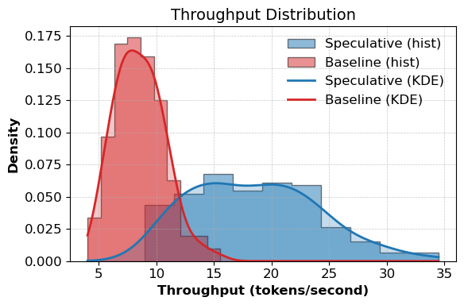
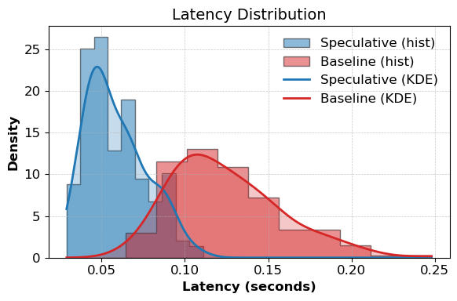

# Speculative Decoding on Reasoning with MiniTorch

This project implements speculative decoding for reasoning tasks (e.g., GSM8K) using a custom framework known as MiniTorch. We utilized the DeepSeek-R1 family to select target and draft models for this particular experiment

### Results on GSM8K
<table style="width: 80%; margin-left: auto; margin-right: auto;">
  <tr>
    <td style="text-align: center;"></td>
    <td style="text-align: center;"></td>
  </tr>
</table>

The project builds a modular speculative decoding pipeline with CUDA acceleration, targeting reasoning task.

## Features
- MiniTorch Backend: PyTorch-style framework for autodiff, tensor ops, and model building
- CUDA Kernels: Custom fast kernels for softmax, layernorm, and tensor ops
- Benchmark: Evaluate on GSM8K and LIMO

## Quickstart
```
conda create -n specdecode python=3.10
conda activate specdecode
```
### Install Dependencies:
```
pip install -r requirements.extra.txt
pip install -r requirements.txt
pip install -e .
```

### Compile CUDA Kernels:
```
bash compile_cuda.sh
```

### Run:
```
python project/run_spec_decoding.py
```


## References
<a id="1">[1]</a> Leviathan, Y., Kalman, M. &amp; Matias, Y.. (2023). Fast Inference from Transformers via Speculative Decoding. <i>Proceedings of the 40th International Conference on Machine Learning</i>, in <i>Proceedings of Machine Learning Research</i> 202:19274-19286 Available from https://proceedings.mlr.press/v202/leviathan23a.html.

<a id="2">[2]</a> Chen, C., Borgeaud, S., Irving, G., Lespiau, J. B., Sifre, L., & Jumper, J. (2023). Accelerating large language model decoding with speculative sampling. arXiv preprint arXiv:2302.01318. 

### Acknowledgements
We'd like to thank [Romsto](https://github.com/romsto) for providing an interesting interface that served as a basis for some aspects of this project.

