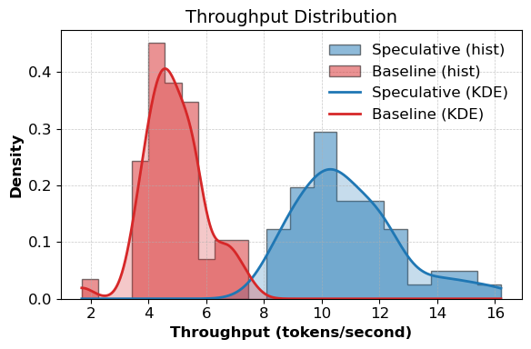
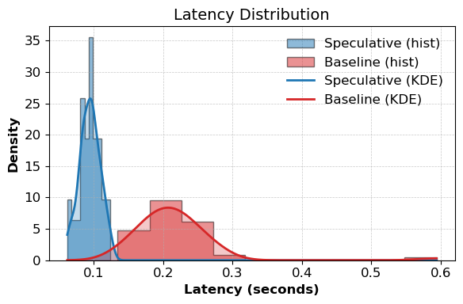

# Speculative Decoding on Reasoning Tasks with MiniTorch

This project implements speculative decoding for reasoning tasks (e.g., GSM8K) using a custom framework known as MiniTorch. We utilized the DeepSeek-R1 family to select target and draft models for this particular experiment

### Results on GSM8K
<table style="width: 80%; margin-left: auto; margin-right: auto;">
  <tr>
    <td style="text-align: center;"></td>
    <td style="text-align: center;"></td>
  </tr>
</table>

### Results on LIMO
<table style="width: 80%; margin-left: auto; margin-right: auto;">
  <tr>
    <td style="text-align: center;"></td>
    <td style="text-align: center;"></td>
  </tr>
</table>

The project builds a modular speculative decoding pipeline with CUDA acceleration, targeting reasoning tasks.

Example for a 100 token limit:
```
> Who is better Ronaldo or Messi?
========== Speculative ==========
Out: Okay, so I need to figure out whether Ronaldo or Messi is better. Hmm, both are big names in football, but I'm not sure how to compare them. Let me start by recalling what I know about each of them.

Ronaldo, I think, is from Brazil. He's been playing for a long time, maybe 15 years or more. He's known for his skills, especially in the Air, which is a term I've heard in relation to football.
Acceptance rate: 1.000
Throughput: 19.3 tokens/s
=========== Target AR ===========
Out: Okay, so I need to figure out who is better between Ronaldo and Messi. Hmm, both are incredible players, but I'm not sure how to compare them. Let me think about their styles first. Ronaldo plays as a striker, right? He's known for his speed and powerful strikes. Messi, on the other hand, is a midfielder who plays in a more advanced role but can also score goals. 

I guess their strengths are different. Ronaldo's strength is his finishing and ability to run
Throughput: 16.6 tokens/s
```

## Features
- MiniTorch Backend: PyTorch-style framework for autodiff, tensor ops, and model building
- CUDA Kernels: Custom fast kernels for softmax, layernorm, and tensor ops
- Benchmark: Evaluate on GSM8K and LIMO

## Quickstart
```
conda create -n specdecode python=3.10
conda activate specdecode
```
### Install Dependencies:
```
pip install -r requirements.extra.txt
pip install -r requirements.txt
pip install -e .
```

### Compile CUDA Kernels:
Not required unless additional kernels were implemented
```
bash compile_cuda.sh
```

### Run:
```
python project/run_spec_decoding.py
```


## References
<a id="1">[1]</a> Leviathan, Y., Kalman, M. &amp; Matias, Y.. (2023). Fast Inference from Transformers via Speculative Decoding. <i>Proceedings of the 40th International Conference on Machine Learning</i>, in <i>Proceedings of Machine Learning Research</i> 202:19274-19286 Available from https://proceedings.mlr.press/v202/leviathan23a.html.

<a id="2">[2]</a> Chen, C., Borgeaud, S., Irving, G., Lespiau, J. B., Sifre, L., & Jumper, J. (2023). Accelerating large language model decoding with speculative sampling. arXiv preprint arXiv:2302.01318. 

<a id="3">[3]</a> Cobbe, K., Kosaraju, V., Bavarian, M., Chen, M., Jun, H., Kaiser, L., Plappert, M., Tworek, J., Hilton, J., Nakano, R., Hesse, C., and Schulman, J. Training verifiers to solve math word problems, 2021. URL https://arxiv.org/abs/2110.14168.

<a id="4">[4]</a> Rush, S., Gao, G., Abilov, A., and Gokaslan., A. Minitorch, 2021. URL https://minitorch.org.

<a id="5">[5]</a> Ye, Y., Huang, Z., Xiao, Y., Chern, E., Xia, S., and Liu, P. Limo: Less is more for reasoning, 2025. URL https://arxiv.org/abs/2502.03387.

<a id="6">[6]</a> Gao, X., Xie, W., Xiang, Y., and Ji, F. Falcon: Faster and parallel inference of large language models through enhanced semi-autoregressive drafting and custom-designed decoding tree, 2024. URL https://arxiv.org/abs/2412.12639

### Acknowledgements
We would like to thank [Romsto](https://github.com/romsto) and [Feifeibear](https://github.com/feifeibear) for their work, which has given us a structure to work off of.
